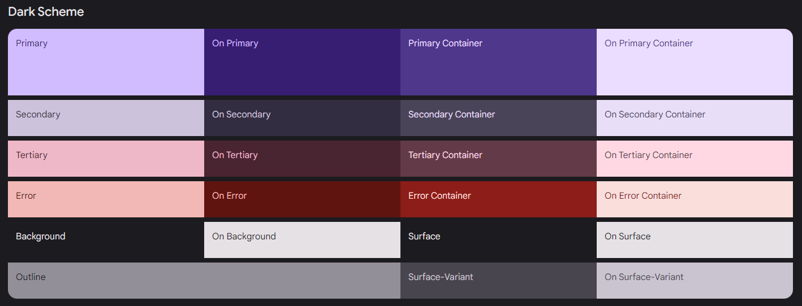

# معرفی
در فریم‌ورک فلاتر، "Material 3" یک نسخه جدید از کتابخانه طراحی اصلی فلاتر به نام "Material Design" است.
متریال دیزاین یک استاندارد طراحی از گوگل برای طراحی و توسعه برنامه‌ها و وب سایت‌ها است. متریال دیزاین شامل راه حل‌های طراحی، ابزارها، و قوانین طراحی است که به توسعه دهندگان کمک میکند تا رابط‌های کاربری زیبا و کارآمد ایجاد کنند.

متریال3 نسخه‌ی جدید و به‌روزشده‌ی این کتابخانه است که احتمالا ویژگی‌ها، تغییرات و بهبود‌های جدیدی نسبت به نسخه‌های قبلی دارد. این نسخه ممکن است شامل الگو‌های طراحی جدید، افکت‌های زیباتر، بهبود‌های در زمینه‌ی کارایی و سرعت و ... باشد. با استفاده از متریال3 توسعه دهندگان میتوانند برنامه‌هایی با رابط کاربری مدرن و جذاب بسازند که با استاندارد‌های طراحی جدید و ترکیبات رنگی و افکت‌های متنوع، کاربران را جذب کنند و تجربه‌ی بهتری را برای آن‌ها فراهم کنند.

# سایت
وارد سایت <a href="https://m3.material.io/theme-builder#/custom" target="_blank">Material3</a> بشین.   
در سمت چپ سایت 4 رنگ اصلی به شکل زیر می‌بینید:  
  

انتخاب رنگ‌ها برای طراحی رابط کاربری(UI) بسیار مهم است و می‌تواند تاثیر زیادی بر تجربه کاربری داشته باشد. با توجه به توضیحاتی که ارائه دادید، می‌توانید از مراحل زیر برای انتخاب رنگ‌های Primary, Secondary, Tertiary, Neutral استفاده کنید:

### رنگ اصلی (Primary Color):
* این رنگ باید رنگ اصلی و برجسته برند یا اپلیکیشن شما باشد.
* از نظر روانشناسی رنگ، ممکن است رنگی باشد که بازخورد مثبتی از کاربران دریافت کند یا به موضوع و برند شما مرتبط باشد.
* معمولا این رنگ باید با نقاط مهم و اقلام برجسته در رابط کاربری شما همخوانی داشته باشد.

### رنگ ثانویه (Secondary Color):
* این رنگ به عنوان یک رنگ پشتیبان برای رنگ اصلی عمل میکند.
* ممکن است برای عناصر مختلفی مانند دکمه‌ها، لینک‌ها یا عناصر انتخابی مورد استفاده قرار گیرد.
* باید با رنگ اصلی هماهنگ باشد اما به اندازه رنگ اصلی برجسته نباشد.

### رنگ سومی (Tertiary Color):
* این رنگ برای استفاده جزئیات کمتر و بخش‌هایی که نیاز به تمایز کمتری دارند، مناسب است.
* معمولا برای برجسته کردن جزئیات کوچکتر مانند سایه‌ها، خطوط تزئینی و آیکون‌ها استفاده می‌شود.

### رنگ محائطه (Neutral Color):
* این رنگ معمولا برای پس‌زمینه و سطوح اصلی رابط کاربری مانند پس‌زمینه صفحه یا بخش‌هایی که نیاز به تمرکزبیشتر بر روی محتوا دارند، استفاده می‌شود.
* رنگ نیوترال باید از طریق UI با رنگ های دیگر سازگاری داشته باشد و معمولا به عنوان پایه رنگی برای بیشتر اجزای رابط کاربری انتخاب می‌شود.

در نهایت، برای انتخاب بهترین ترکیب رنگ، می‌توانید از روش های مختلفی مانند انتخاب رنگ‌های کنار هم در دایره رنگی، استفاده از ابزار‌های طراحی UI مثل Adobe Color و یا اعمال آزمون و خطا بر روی نمونه‌های UI استفاده کنید تا به بهترین ترکیب رنگ برسید. به مثال زیر دقت کنید:

**رنگ اصلی: آبی پررنگ**  
**رنگ ثانویه: آبی روشن**  
**رنگ سومی: آبی کم‌رنگ**  
**رنگ محیطی: سفید یا خاکستری روشن**

این یک ترکیب رنگ است که هماهنگی بین آن‌ها وجود دارد و می‌توانید به تم زیبا و جذابی برای رابط کاربری شما بدهد. با این حال، برای انتخاب نهایی، می‌توانید با نمونه‌سازی و تست‌های بیشتر بهترین ترکیب رنگ را انتخاب کنید.

خب حالا که رنگ مورد نظر را انتخاب کردید به شما نمای کلی از اپلیکیشن را نمایش می‌دهد اگر کمی اسکرول کنید به پایین بروید رنگ‌هایی مشابه به عکس‌های پایین میبینید:

  
  

### اصلی (primary)
رنگ اصلی یا برجسته که برای عناصر اصلی رابط کاربری استفاده می‌شود.

### روی اصلی (onPrimary)
رنگ متن یا عناصر دیگری که بر روی پس‌زمینهٔ رنگ اصلی قرار می‌گیرند.

### مخزن اصلی (primaryContainer)
پس‌زمینهٔ عناصر یا محیط‌هایی که باید رنگ اصلی را به عنوان پس‌زمینه داشته باشند.

### روی مخزن اصلی (onPrimaryContainer)
رنگ متن یا عناصر دیگری که بر روی پس‌زمینهٔ رنگ اصلی قرار می‌گیرند.

### ثانویه (secondary)
رنگ ثانویه که برای عناصر کم‌تر برجسته و مهم‌تر از عناصر سومی استفاده می‌شود.

### روی ثانویه (onSecondary)
رنگ متن یا عناصر دیگری که بر روی پس‌زمینهٔ رنگ ثانویه قرار می‌گیرند.

### مخزن ثانویه (secondaryContainer)
پس‌زمینهٔ عناصر یا محیط‌هایی که باید رنگ ثانویه را به عنوان پس‌زمینه داشته باشند.

### روی مخزن ثانویه (onSecondaryContainer)
رنگ متن یا عناصر دیگری که بر روی پس‌زمینهٔ رنگ ثانویه قرار می‌گیرند.

### سومی (tertiary)
رنگ سومی که برای عناصر کم‌تر برجسته و مهم‌تر از عناصر چهارمی استفاده می‌شود.

### روی سومی (onTertiary)
رنگ متن یا عناصر دیگری که بر روی پس‌زمینهٔ رنگ سومی قرار می‌گیرند.

### مخزن سومی (tertiaryContainer)
پس‌زمینهٔ عناصر یا محیط‌هایی که باید رنگ سومی را به عنوان پس‌زمینه داشته باشند.

### روی مخزن سومی (onTertiaryContainer)
رنگ متن یا عناصر دیگری که بر روی پس‌زمینهٔ رنگ سومی قرار می‌گیرند.

### خطا (error)
رنگ برای نمایش خطاها یا وضعیت‌های نادرست.

### روی خطا (onError)
رنگ متن یا عناصر دیگری که بر روی پس‌زمینهٔ رنگ خطا یا وضعیت نادرست قرار می‌گیرند.

### مخزن خطا (errorContainer)
پس‌زمینهٔ عناصر یا محیط‌هایی که باید رنگ خطا یا وضعیت نادرست را به عنوان پس‌زمینه داشته باشند.

### روی مخزن خطا (onErrorContainer)
رنگ متن یا عناصر دیگری که بر روی پس‌زمینهٔ رنگ خطا یا وضعیت نادرست قرار می‌گیرند.

### خط کشیدن (outline)
تعیین رنگ حاشیه یا مرز برای عناصر رابط کاربری.

### پس‌زمینه (background)
رنگ پس‌زمینه برای سراسری رابط کاربری.

### روی پس‌زمینه (onBackground)
رنگ متن یا عناصر دیگری که بر روی پس‌زمینهٔ رنگ پس‌زمینه قرار می‌گیرند.

### سطح (surface)
رنگ سطح یا پس‌زمینهٔ عناصر سطحی مانند کارت‌ها و پنل‌ها در رابط کاربری.

### روی سطح (onSurface)
رنگ متن یا عناصر دیگری که بر روی پس‌زمینهٔ رنگ سطح قرار می‌گیرند.

### نسخهٔ سطح (surfaceVariant)
ویژگی‌های متغیر سطح که از آنها برای ارتقاء ظاهر سطح استفاده می‌شود.

### روی نسخهٔ سطح (onSurfaceVariant)
رنگ متن یا عناصر دیگری که بر روی پس‌زمینهٔ ویژگی‌های متغیر سطح قرار می‌گیرند.

### مخزن معکوس سطح (inverseSurface)
ویژگی‌های معکوس سطح که برای ظاهر معکوس سطح استفاده می‌شود.

### روی مخزن معکوس سطح (onInverseSurface)
رنگ متن یا عناصر دیگری که بر روی پس‌زمینهٔ ویژگی‌های معکوس سطح قرار می‌گیرند.

### معکوس اصلی (inversePrimary)
ویژگی‌های معکوس اصلی که برای ظاهر معکوس اصلی استفاده می‌شود.

### سایه (shadow)
رنگ سایه برای اجزاء رابط کاربری که سایه دارند.

### رنگ سطح (surfaceTint)
رنگ اعمال شده به سطح‌ها و عناصر مختلف برای ایجاد یک تأثیر ظاهری معین.

### نسخهٔ خط کشیدن (outlineVariant)
ویژگی‌های متغیر حاشیه که برای ارتقاء ظاهر حاشیه‌ها استفاده می‌شود.

### پارده (scrim)
یک پوشش نیمه شفاف که بر روی پس‌زمینهٔ رابط کاربری قرار می‌گیرد و برای ایجاد تأثیر‌های مختلف مورد استفاده قرار می‌گیرد.

